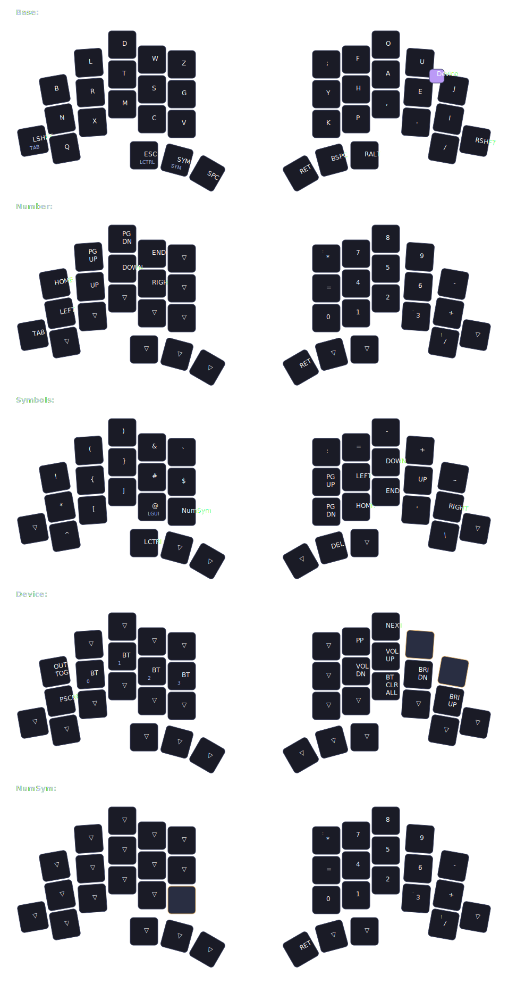

# Keyboards Firmware

Multi-keyboard firmware configurations using [Graphite](https://github.com/rdavison/graphite-layout) alpha layout with automated builds.

## TOTEM

38-key split, Seeeduino XIAO BLE, ZMK Studio enabled.



### Behaviors

| Key | Tap | + Shift | Notes |
|-----|-----|---------|-------|
| `LSHFT` | `LSHFT` | `LGUI` | left pinky, lshift_morph (+ RSHFT) |
| `RSHFT` | `RSHFT` | `RGUI` | right pinky, rshift_morph (+ LSHFT) |
| `NUM` | `&mo NUM` | `&tog NUM` | right thumb, num_morph |

### Vim Symbols (SYM left hand)

| Key | Vim usage |
|-----|-----------|
| `$` | end of line |
| `^` | first non-blank character |
| `{` `}` | paragraph movement |
| `%` | bracket matching |
| `*` `#` | search word under cursor reverse |
| `;` | repeat last f t motion |
| `!` | filter through external command |
| `@` | execute macro |
| `&` | repeat last substitution |

### Layers

```
Base (Graphite)
├── Symbols          left thumb hold     brackets, nav, arrows
├── Number           right thumb hold    numpad, left-hand arrows
└── Device           both thumbs held    BT, media, brightness
                     (Symbols + Number conditional layer)
```

## Keyboards

All ZMK keyboards share `graphite.dtsi` as the base layout definition, each extending it for their key count.

```
config/graphite.dtsi          shared alphas, layers, behaviors
│
├── ZMK
│   ├── totem.keymap          38 keys (GRAPHITE_*_38)
│   ├── corne.keymap          36 keys (GRAPHITE_*_36)
│   └── eyelash_corne.keymap  42 keys (GRAPHITE_*_42)
│
└── QMK
    └── iris/                 Keebio Iris, separate config
```

## Scripts

```
scripts/configs.sh        # list/pick keyboard, then draw or flash
scripts/draw-keymaps.sh   # render keymap SVGs (all or filtered)
scripts/flash-zmk.sh      # fetch + flash ZMK firmware
scripts/flash-qmk.sh      # fetch + flash QMK firmware (Iris)
```

## Dependencies

- `gh` (GitHub CLI)
- `gum` (interactive prompts)
- `keymap-drawer` (keymap visualization, auto-installed in venv)
- `qmk` (QMK CLI, for Iris only)
