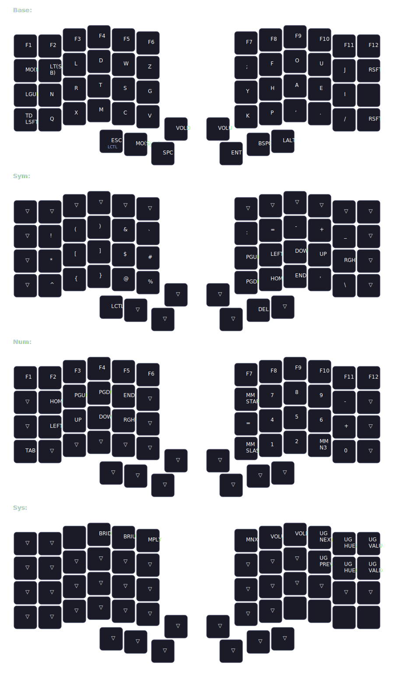
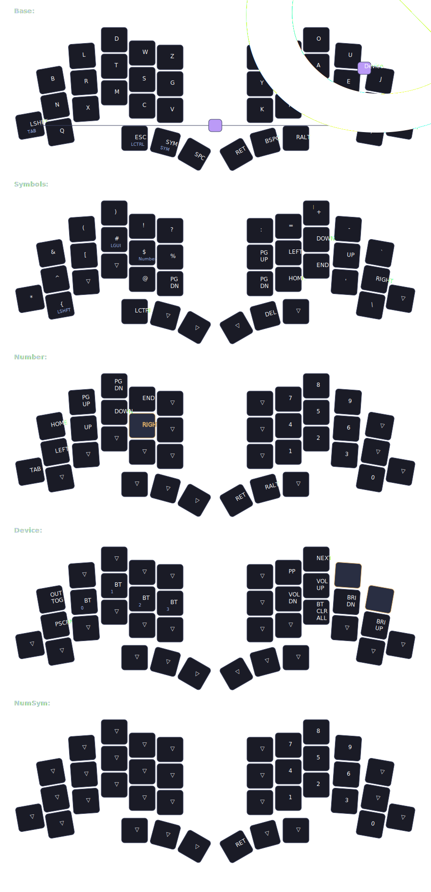
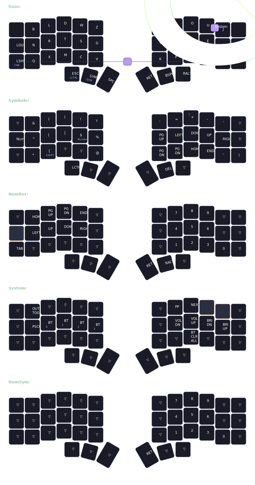
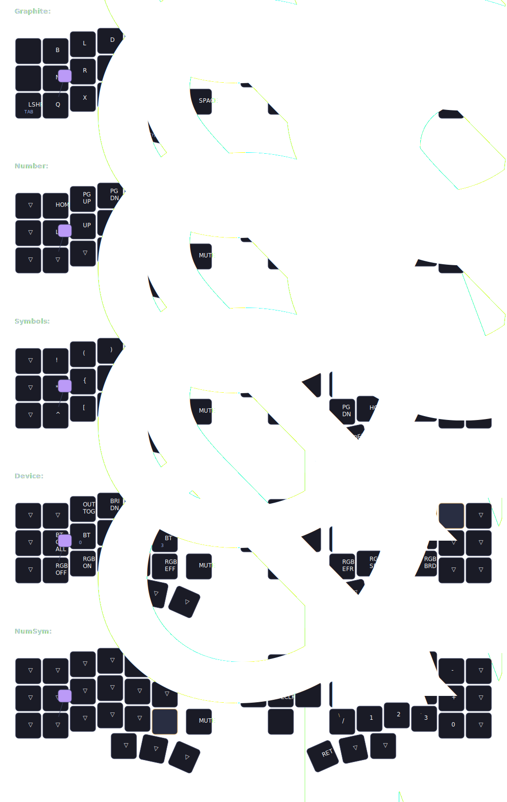

# Keyboards Firmware

Multi-keyboard firmware configurations using [Graphite](https://github.com/rdavison/graphite-layout) alpha layout with automated builds.

## CLI

```
bun run cli -- status              # CI build status
bun run cli -- list                # list keyboards
bun run cli -- draw [keyboard]     # render keymap SVGs
bun run cli -- flash <kb> <side>   # download + flash firmware
bun run flash-totem                # flash both sides
bun run flash-eyelash
bun run flash-corne
```

## Iris

Split ergonomic, QMK, Keebio Iris LM.



## Totem

38-key split, Seeeduino XIAO BLE, ZMK Studio enabled.



## Corne

36-key split, nice!nano v2.



## Eyelash Corne

42-key split, custom nRF52840 board, joystick + encoder.



### Behaviors

| Key | Tap | + Shift | Notes |
|-----|-----|---------|-------|
| `LSHFT` | `LSHFT` | `LGUI` | left pinky, lshift_morph (+ RSHFT) |
| `RSHFT` | `RSHFT` | `RGUI` | right pinky, rshift_morph (+ LSHFT) |
| `NUM` | `&mo NUM` | `&tog NUM` | right thumb, num_morph |

### Vim Symbols (SYM left hand)

| Key | Vim usage |
|-----|-----------|
| `$` | end of line |
| `^` | first non-blank character |
| `{` `}` | paragraph movement |
| `%` | bracket matching |
| `*` `#` | search word under cursor reverse |
| `;` | repeat last f t motion |
| `!` | filter through external command |
| `@` | execute macro |
| `&` | repeat last substitution |

### Layers

```
Base (Graphite)
├── Symbols          left thumb hold     brackets, nav, arrows
├── Number           right thumb hold    numpad, left-hand arrows
└── Device           both thumbs held    BT, media, brightness
                     (Symbols + Number conditional layer)
```

## ZMK

Config must live in `config/` (ZMK convention). All keyboards share `graphite.dtsi` as the base layout.

```
config/
├── graphite.dtsi              shared alphas, layers, behaviors
├── totem.keymap               38 keys (GRAPHITE_*_38)
├── totem.conf
├── corne.keymap               36 keys (GRAPHITE_*_36)
├── corne.conf
├── corne_left.conf
├── eyelash_corne.keymap       42 keys (GRAPHITE_*_42)
├── eyelash_corne.conf
└── eyelash_corne_left.conf
build.yaml                     GitHub Actions build matrix
```

## QMK

```
keyboards/keebio/iris_lm/k1/keymaps/graphite/
```
