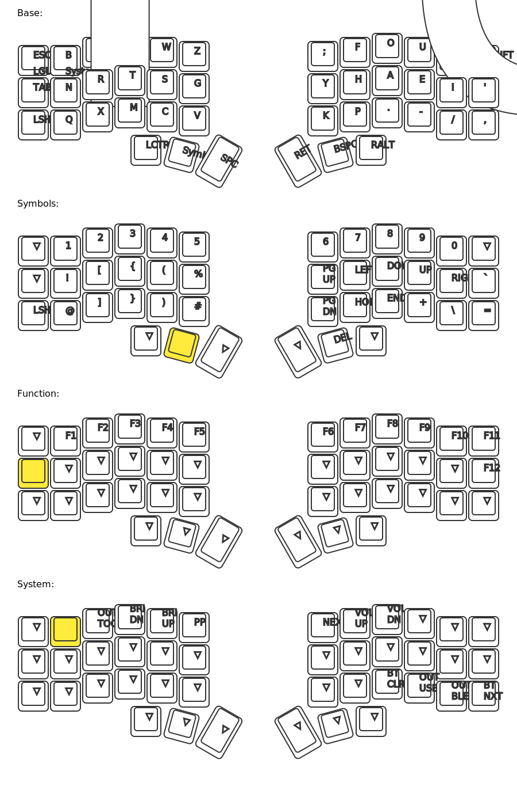

# Corne Graphite Layout



## Base

```
ESC B L D W Z       ; F O U J =
TAB N R T S G       Y H A E I '  
SFT Q X M C V       K P . - / , 
   CTRL LOWER SPC   ENT BSPC RALT
```

*Hold ESC for Extra layer • Hold SPACE for Raise layer • Press SPACE+LOWER for START key*

## Lower

```
--- 1 2 3 4 5      6    7  8   9   0 ---
--- --- [ { ( ↑   ↓    ←  →   `   --- ---
--- --- ] } ) HOME END +  \   --- --- ---
   --- --- ---    --- --- ---
```

## Raise

```
--- F1 F2 F3 F4 F5    F6 F7 F8 F9 F10 ---
--- --- --- --- --- ---    --- --- --- --- F11 ---
--- --- --- --- --- ---    --- --- --- --- F12 ---
   --- --- ---    START RALT EXTRA
```

*Hold SPACE to access this layer*

## Extra

```
BTCLR --- --- BR_DN BR_UP PLAY    NEXT VOL+ VOL- --- --- BT_0
--- BT_1 BT_2 BT_3 BT_4 ---    --- --- --- --- --- BT_NXT
--- --- --- --- --- ---    --- --- --- --- --- BT_PRV
   --- --- ---    --- --- EXTRA
```

*Hold ESC to access this layer*