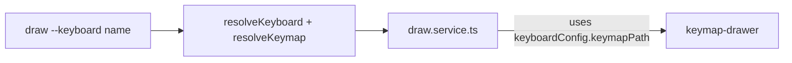

# Draw Service Payload Normalization

## Goal

Refactor the draw command to accept file paths or inline JSON directly instead of requiring keyboard config lookup. The service should normalize input via hooks into a unified payload format.

## Current flow



## Target architecture

```mermaid
flowchart LR
    CLI["draw --path OR --config OR --json "] --> Hook["normalizePayload hook"]
    Hook -->|{ type, format, src }| Service["draw.service.ts"]
    Service --> KeymapDrawer["keymap-drawer"]
```

**Why:** Decouple draw from keyboard config, allow direct file path or inline data input.

## Supported Formats

keymap-drawer supports:
- **ZMK**: `.keymap` files (YAML-like DSL) → `keymap parse -z`
- **QMK**: `.c` files or JSON → `keymap parse -q`

## Payload Format

```typescript
type Payload = 
  | { type: "file"; format: "zmk" | "qmk"; src: string }  // file path
  | { type: "json"; format: "zmk" | "qmk"; src: string }  // inline content
```

## CLI Usage

```bash
# File path (auto-detect format from extension)
draw --path ./config/corne.keymap

# Keyboard config name (uses config for format detection)
draw --config corne

# Inline JSON/YAML content
draw --json '{"layers": [...]}' --format qmk
draw --json 'keymap: {...}' --format zmk
```

## Structure

```
draw/
├── draw.schema.ts       # accepts path | config | json + format
├── draw.hooks.ts        # normalizePayload hook creates unified payload
├── draw.service.ts      # consumes payload, handles file/json types
└── draw.cli.tsx         # --path, --config, --json, --format flags
```

## What Was Built

**`draw.schema.ts`**
- Accepts `path`, `config`, `json` (one required) and optional `format`
- Auto-detects format from file extension when not specified

**`draw.hooks.ts`**
- `normalizePayload()` hook creates unified payload: `{ type, format, src }`
- Format detection: `.keymap`/`.yaml` → zmk, `.c`/`.json` → qmk
- Falls back to content heuristics or defaults to zmk

**`draw.service.ts`**
- Consumes `params.payload` instead of `keyboardConfig.keymapPath`
- Handles both `type: "file"` and `type: "json"` payloads
- For inline JSON, writes to temp file before parsing

## Tasks

| | Group | Action |
|---|-------|--------|
| [x] | schema | Update draw.schema.ts to accept path/config/json + format |
| [x] | hooks | Add normalizePayload hook in draw.hooks.ts |
| [x] | service | Update draw.service.ts to accept payload and handle formats |
